<!-- generated by scripts/readme/build.mjs. do not edit by hand. -->

<picture>
<source media="(max-width: 500px) and (prefers-color-scheme: dark)" srcset="assets/readme/boot-narrow-dark.svg">
<source media="(max-width: 500px)" srcset="assets/readme/boot-narrow-light.svg">
<source media="(prefers-color-scheme: dark)" srcset="assets/readme/boot-dark.svg">

</picture>

Harness Firmware stores agent instructions, project notes, reusable skills, and verification rules in the repository for Claude Code and Codex.

[Install the skills or start a repository](#quickstart).

## the repository feedback loop

<picture>
<source media="(max-width: 500px) and (prefers-color-scheme: dark)" srcset="assets/readme/feedback-narrow-dark.svg">
<source media="(max-width: 500px)" srcset="assets/readme/feedback-narrow-light.svg">
<source media="(prefers-color-scheme: dark)" srcset="assets/readme/feedback-dark.svg">

</picture>

The everyday loop is **recall → work → verify → refine → reviewed repository change → next task**. Project facts load before unfamiliar work. Verification captures evidence. `refine` turns observed friction into a small, reviewable change that strengthens the repository before the next task begins.

The dotted branch is separate: after human review, `sync-starter` can move a generic improvement into the template so future repositories begin with it. Keeping the lesson local remains the default.

## quickstart

Use the **skills-only plugin** for an existing Claude Code repository. Use the **full template** for a new repository or Codex support.

### existing repository · Claude Code plugin

Run these commands inside Claude Code:

```text
/plugin marketplace add ryanportfolio/Harness-Firmware
/plugin install claude-starter@claude-starter
```

Then try `/claude-starter:recall` or `/claude-starter:brainstorming plan the next feature`. Plugin skills use the `claude-starter` namespace.

### new repository · full template

Create a repository with the kernel, hooks, committed memory, skills, and synchronization tools:

- GitHub: select **Use this template**, clone the new repository, then run Claude Code's `/init-project` command or ask Codex to use the `init-project` skill.
- From a cloned Harness Firmware checkout on macOS or Linux: `bash bootstrap/new-claude-project.sh --name my-app --dest ~/code`
- From a cloned checkout on Windows: double-click `bootstrap/New-ClaudeProject.cmd`.

In the created repository, run `node .claude/scripts/doctor.mjs`. Success means the doctor reports no failures. Then ask Claude Code or Codex to use `recall` before the first unfamiliar change.

[Open the complete setup guide](GUIDE.md#full-template) · [View validation runs](https://github.com/ryanportfolio/Harness-Firmware/actions/workflows/validate-template.yml)

## one source, two runtime boundaries

<picture>
<source media="(max-width: 500px) and (prefers-color-scheme: dark)" srcset="assets/readme/runtime-narrow-dark.svg">
<source media="(max-width: 500px)" srcset="assets/readme/runtime-narrow-light.svg">
<source media="(prefers-color-scheme: dark)" srcset="assets/readme/runtime-dark.svg">

</picture>

- **Claude Code:** reads `CLAUDE.md`, `.claude/skills/`, and hooks for canonical playbooks and Claude-specific startup behavior.
- **Codex:** reads `AGENTS.md` and `.agents/skills/` for generated discovery adapters with explicit capability and safety boundaries.

Both runtimes read the committed project topics under `.claude/reference/`. Workflow bodies stay canonical under `.claude/skills/`.

## 30 workflows, loaded when called

**8 core · 8 discipline · 14 specialist**

Only names and routing descriptions sit in the repository's generated skill index. Full workflow bodies stay on demand. The diagram's byte figures are a repository source-file estimate, not total runtime context; [the guide documents the measurement](GUIDE.md#measure-the-always-loaded-layer).

<details>
<summary>Open the generated skill memory map</summary>

<picture>
<source media="(max-width: 500px) and (prefers-color-scheme: dark)" srcset="assets/readme/skills-narrow-dark.svg">
<source media="(max-width: 500px)" srcset="assets/readme/skills-narrow-light.svg">
<source media="(prefers-color-scheme: dark)" srcset="assets/readme/skills-dark.svg">

</picture>

</details>

<details>
<summary>Browse every skill</summary>

<!-- skill-list:start -->
### core workflows · 8

- [`init-project`](.claude/skills/init-project/SKILL.md) · Use once in a spawned starter repo when the user asks to initialize or configure it, or when FILL IN markers remain; never auto-run in a claude-starter template checkout.
- [`recall`](.claude/skills/recall/SKILL.md) · Use before unfamiliar project-area edits, when the user asks what the project knows or its pitfalls, or when saving durable project-specific learning.
- [`addskill`](.claude/skills/addskill/SKILL.md) · Use whenever a repo-local skill is being added, installed, or created for future Claude Code and Codex sessions, whether the user asked or you decided to write one; writing-skills covers authoring, not this repo's install contract.
- [`sync-starter`](.claude/skills/sync-starter/SKILL.md) · Use when the user asks to pull template improvements into a spawned repo, compare starter drift, or push a generic improvement back to the starter.
- [`optimize-context`](.claude/skills/optimize-context/SKILL.md) · Use when the user asks to reduce per-turn context or token load, trim kernels, skills, or connectors, or propagate a generic context optimization to the starter.
- [`refine`](.claude/skills/refine/SKILL.md) · Use when a session or task is wrapping up ("wrap up", "that's everything", "done for today"), when the user invokes /refine, or after any task with friction: calls wasted rediscovering a fact, a skill that misfired, a user correction.
- [`merge`](.claude/skills/merge/SKILL.md) · Use only when the user explicitly asks to enable session-wide automatic commit, push, PR, and merge; not for one-shot shipping requests.
- [`automate-me`](.claude/skills/automate-me/SKILL.md) · Use for "automate me", "/automate-me", "create/update my -mode skill", or "turn my preferences / working style into a skill". Mines the current project's transcripts plus direct questions, then drafts a personal <handle>-mode skill.

### quality disciplines · 8

- [`brainstorming`](.claude/skills/brainstorming/SKILL.md) · Use when brainstorming or designing a product, interface, workflow, architecture, or behavior change with unresolved goals or material tradeoffs; not for routine or fully specified work.
- [`writing-plans`](.claude/skills/writing-plans/SKILL.md) · Use when you have a spec or requirements for a multi-step task, before touching code
- [`impartial-review`](.claude/skills/impartial-review/SKILL.md) · Use when the user asks to review, audit, or stress-test recent code changes with fresh independent agents; requires exposed multi-agent tools.
- [`writing-skills`](.claude/skills/writing-skills/SKILL.md) · Use when creating new skills, editing existing skills, or verifying skills work before deployment
- [`long-horizon`](.claude/skills/long-horizon/SKILL.md) · Use for work too big for one context window: long multi-step tasks, progress lost to compaction or failed retries, work spanning hours or sessions, or when the user says /long-horizon or asks to run a task in verified rounds.
- [`babysit-ci`](.claude/skills/babysit-ci/SKILL.md) · Watch a PR's checks and iterate on failures until green. Use for /babysit-ci, "watch CI", "fix CI", "get the checks green", or when a PR is waiting on failing or pending checks.
- [`codex-review`](.claude/skills/codex-review/SKILL.md) · Cross-vendor second-opinion review. Drives OpenAI Codex CLI (codex exec review, gpt-5.6-sol, high reasoning) over a PR, branch, commit, or uncommitted diff, then verifies each finding. Trigger: /codex-review, "have Codex/Sol review this".
- [`verify-this`](.claude/skills/verify-this/SKILL.md) · Verify a claim with fresh local evidence: restate it falsifiably, capture baseline and treatment, compare, return VERIFIED, NOT VERIFIED, or INCONCLUSIVE. Use for /verify-this, "prove it works", "did this fix it", "show me the evidence".

### specialist tools · 14

- [`fable-mode`](.claude/skills/fable-mode/SKILL.md) · Use proactively for hard layered work with dependent steps, load-bearing unknowns, repeated failures, or verification-sensitive handoff; also when the user asks for Fable mode.
- [`wow-loop`](.claude/skills/wow-loop/SKILL.md) · Multi-agent perfection loop for any deliverable. Recon, one spec, one implementer, adversarial screenshot-verified critique until an evidence gate passes. Use when the user says /wow-loop, asks for "wow factor" or "dial it to 11".
- [`arena`](.claude/skills/arena/SKILL.md) · Spawn N parallel candidate attempts at one task, pick the strongest as base, graft the losers' best parts in. Use when the user says /arena, "arena this", or when one attempt at a non-trivial artifact would lock in the wrong shape.
- [`lab`](.claude/skills/lab/SKILL.md) · Use when the user explicitly asks to lab or prototype a visual, UI, motion, or game-feel element with live tuning before production implementation.
- [`advocate`](.claude/skills/advocate/SKILL.md) · Use only when the user explicitly invokes /advocate to challenge a change just made before it lands. Do not trigger from natural-language requests.
- [`why`](.claude/skills/why/SKILL.md) · Use only when the user explicitly invokes /why to challenge the assistant's immediately prior recommendation; never trigger from ordinary why questions or paraphrases.
- [`enhance-prompt`](.claude/skills/enhance-prompt/SKILL.md) · Use when the user asks to rewrite a rough request into a polished, copy/paste-ready prompt for another agent or a fresh session.
- [`handoff-audit`](.claude/skills/handoff-audit/SKILL.md) · Use when the user asks for a self-contained audit prompt to paste into a separate fresh session for independent verification.
- [`humanizer`](.claude/skills/humanizer/SKILL.md) · Use when the user asks to humanize, de-AI, de-slop, voice-match, or review prose for AI tells before publishing.
- [`purposeful-writing`](.claude/skills/purposeful-writing/SKILL.md) · Use when drafting or revising prose for a reader: application answers, emails, essays, bios, cover letters, proposals, memos, reports, product copy, speeches, or when a draft reads as machine-made or must match a writer's own voice.
- [`forge-repo-ui-skill`](.claude/skills/forge-repo-ui-skill/SKILL.md) · Use when the user wants a repository-specific UI or design skill synthesized from current agent skills; not for ordinary UI implementation or backend-only work.
- [`caveman`](.claude/skills/caveman/SKILL.md) · Ultra-compressed communication mode. Cuts token usage ~75% by speaking like caveman while keeping full technical accuracy.
- [`bro`](.claude/skills/bro/SKILL.md) · Restate the assistant's last message in plain human language, no jargon. Use when the user says /bro, "in plain english", "dumb it down", or "what does that actually mean".
- [`unslop`](.claude/skills/unslop/SKILL.md) · Always-on AI-tell stripper: apply its pattern check to everything written for humans (chat prose, commits, PR bodies, docs, UI text). Also use when the user says /unslop, "unslop this", or points at text or a file to clean.
<!-- skill-list:end -->

</details>

## checked on every change

The validation workflow checks shell and PowerShell entry points, generated Codex adapters, the Codex skill contract, JSON manifests, the Windows project generator, README facts, and generated README assets.

Run the local health check:

```bash
node .claude/scripts/doctor.mjs
```

## documentation

- [Setup and operating guide](GUIDE.md)
- [Contribution process](CONTRIBUTING.md)
- [Release history](CHANGELOG.md)
- [Skill provenance](.claude/skills/PROVENANCE.md)
- [MIT license](LICENSE)
